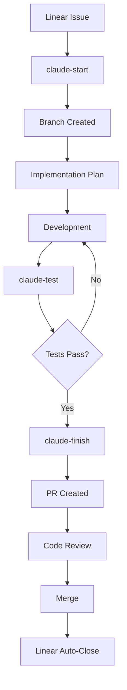

# 🚀 Development Workflow - Linear ↔ GitHub Integration

**Comprehensive development workflow automation with Linear synchronization, quality gates, and PR automation**

[](https://opensource.org/licenses/MIT)
[](https://www.python.org/downloads/)
[](https://linear.app/)
[](https://cli.github.com/)

## 📋 Overview

This project provides a complete development workflow automation system that integrates Linear project management with GitHub development processes. It includes automated issue tracking, branch management, testing pipelines, PR creation, and comprehensive reporting.

### ✨ Key Features

- 🔄 **Bi-directional Linear ↔ GitHub Sync**
- 🚀 **Automated Development Workflow**
- 🧪 **Comprehensive Testing Pipeline**
- 📊 **Quality Gates & Coverage Reporting**
- 🔒 **Security Scanning Integration**
- 📝 **Automatic PR Creation with Rich Metadata**
- 🛡️ **Error Handling & Rollback Capabilities**
- 📈 **Metrics & Analytics Dashboard**

## 🎯 Quick Start

### Prerequisites

- Git repository
- Linear API key
- GitHub CLI authenticated
- Python 3.10+ (optional, for advanced features)

### Installation

```bash
# Clone the repository
git clone https://github.com/franorzabal-hub/development-workflow.git
cd development-workflow

# Make scripts executable
chmod +x scripts/*.sh

# Set your Linear API key
export LINEAR_API_KEY="lin_api_xxxxxxxxxxxxx"

# Run initial setup
./scripts/setup-linear-states.sh

# Validate all dependencies
./scripts/validate-dependencies.sh

# Install workflow aliases (optional)
./scripts/claude-aliases.sh install
```

### Basic Usage

```bash
# Start development for a Linear issue
./scripts/start-development.sh FRA-42

# Run comprehensive tests
./scripts/test-and-validate.sh FRA-42

# Create PR and finish workflow
./scripts/finish-development.sh FRA-42
```

### Simplified Commands (with aliases)

```bash
# Load aliases
source scripts/claude-workflow-aliases.sh

# Simplified workflow
claude-start FRA-42    # Start development
claude-test FRA-42     # Run tests
claude-finish FRA-42   # Create PR
```

## 📚 Documentation

- **[Setup Guide](docs/SETUP.md)** - Detailed installation and configuration
- **[Development Workflow](docs/DEVELOPMENT_WORKFLOW.md)** - Complete workflow guide
- **[API Reference](docs/API_REFERENCE.md)** - Linear and GitHub API integration
- **[Scripts Documentation](docs/SCRIPTS.md)** - Detailed script documentation
- **[Troubleshooting](docs/TROUBLESHOOTING.md)** - Common issues and solutions
- **[Contributing](docs/CONTRIBUTING.md)** - Contribution guidelines

## 🛠️ Core Scripts

### Setup & Validation
- **`setup-linear-states.sh`** - Configure Linear workflow states
- **`validate-dependencies.sh`** - Validate all dependencies

### Development Workflow
- **`start-development.sh`** - Start development with Linear integration
- **`test-and-validate.sh`** - Comprehensive testing pipeline
- **`finish-development.sh`** - PR creation and workflow completion

### Utilities
- **`claude-aliases.sh`** - Simplified command interface
- **`linear-env.sh`** - Environment configuration (auto-generated)

## 🔄 Development Workflow



## 🧪 Testing Pipeline

The testing pipeline includes:

- **Code Formatting** (Black, isort)
- **Linting** (flake8, mypy)
- **Security Scanning** (Bandit)
- **Unit Testing** (pytest with coverage)
- **Integration Testing**
- **Performance Testing**

### Quality Gates

- ✅ Code coverage > 90%
- ✅ All linting checks pass
- ✅ Security scan grade A
- ✅ All tests pass
- ✅ No breaking changes

## 🔒 Security

- API keys are masked in logs
- Security scanning with Bandit
- Input validation for all scripts
- Secure environment variable handling
- Comprehensive error handling

## 📊 Metrics & Reporting

The system provides comprehensive metrics:

- Development velocity
- Code quality metrics
- Test coverage trends
- Security scan results
- PR success rates

## 🤝 Contributing

We welcome contributions! Please see our [Contributing Guide](docs/CONTRIBUTING.md) for details.

### Development Setup

```bash
# Clone the repo
git clone https://github.com/franorzabal-hub/development-workflow.git
cd development-workflow

# Create virtual environment
python3 -m venv venv
source venv/bin/activate

# Install development dependencies
pip install -r requirements-dev.txt

# Run tests
pytest tests/
```

## 📄 License

This project is licensed under the MIT License - see the [LICENSE](LICENSE) file for details.

## 🙏 Acknowledgments

- [Linear](https://linear.app/) for excellent project management API
- [GitHub CLI](https://cli.github.com/) for seamless GitHub integration
- [pytest](https://pytest.org/) for comprehensive testing framework

## 📞 Support

- 📧 Email: support@example.com
- 🐛 Issues: [GitHub Issues](https://github.com/franorzabal-hub/development-workflow/issues)
- 📖 Docs: [Documentation](docs/)

---

**Made with ❤️ for developers who love automation**