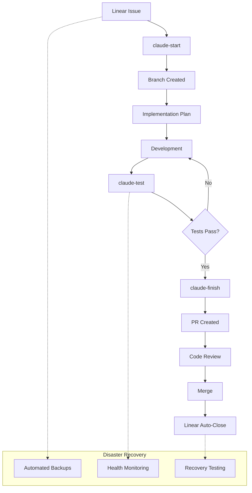

# 🚀 Development Workflow - Linear ↔ GitHub Integration

**Comprehensive development workflow automation with Linear synchronization, quality gates, and disaster recovery capabilities**

[](https://opensource.org/licenses/MIT)
[](https://www.python.org/downloads/)
[](https://linear.app/)
[](https://cli.github.com/)
[](docs/DISASTER_RECOVERY.md)

## 📋 Overview

This project provides a complete development workflow automation system that integrates Linear project management with GitHub development processes. It includes automated issue tracking, branch management, testing pipelines, PR creation, comprehensive reporting, and enterprise-grade disaster recovery capabilities.

### ✨ Key Features

- 🔄 **Bi-directional Linear ↔ GitHub Sync**
- 🚀 **Automated Development Workflow**
- 🧪 **Comprehensive Testing Pipeline**
- 📊 **Quality Gates & Coverage Reporting**
- 🔒 **Security Scanning Integration**
- 📝 **Automatic PR Creation with Rich Metadata**
- 🛡️ **Error Handling & Rollback Capabilities**
- 📈 **Metrics & Analytics Dashboard**
- 🆘 **Disaster Recovery & Risk Mitigation**
- 💾 **Automated Backup & Recovery**

## 🎯 Quick Start

### Prerequisites

- Git repository
- Linear API key
- GitHub CLI authenticated
- Python 3.10+ (optional, for advanced features)

### Installation

```bash
# Clone the repository
git clone https://github.com/franorzabal-hub/development-workflow.git
cd development-workflow

# Make scripts executable
chmod +x scripts/*.sh

# Set your Linear API key
export LINEAR_API_KEY="lin_api_xxxxxxxxxxxxx"

# Run initial setup
./scripts/setup-linear-states.sh

# Validate all dependencies
./scripts/validate-dependencies.sh

# Install workflow aliases (optional)
./scripts/claude-aliases.sh install
```

### Basic Usage

```bash
# Start development for a Linear issue
./scripts/start-development.sh FRA-42

# Run comprehensive tests
./scripts/test-and-validate.sh FRA-42

# Create PR and finish workflow
./scripts/finish-development.sh FRA-42
```

### Simplified Commands (with aliases)

```bash
# Load aliases
source scripts/claude-workflow-aliases.sh

# Simplified workflow
claude-start FRA-42    # Start development
claude-test FRA-42     # Run tests
claude-finish FRA-42   # Create PR
```

## 🛡️ Disaster Recovery

This system includes enterprise-grade disaster recovery capabilities:

```bash
# System health assessment
./scripts/disaster-recovery-assessment.sh

# Create system backup
./scripts/backup-system.sh daily

# Emergency recovery
./scripts/recovery-procedures.sh emergency

# Selective recovery
./scripts/recovery-procedures.sh selective backup.tar.gz config
```

### Recovery Objectives

- **RTO (Recovery Time Objective):** 15 minutes for critical functions
- **RPO (Recovery Point Objective):** 0 data loss for configurations
- **Automated Testing:** Weekly disaster recovery validation
- **Backup Strategy:** Daily/weekly/snapshot backups with encryption

## 📚 Documentation

### Core Documentation
- **[Getting Started](docs/GETTING_STARTED.md)** - 15-minute setup guide
- **[Development Workflow](docs/DEVELOPMENT_WORKFLOW.md)** - Complete workflow guide
- **[API Reference](docs/API_REFERENCE.md)** - Linear and GitHub API integration
- **[Security Guidelines](SECURITY.md)** - Security best practices
- **[Troubleshooting](docs/TROUBLESHOOTING.md)** - Common issues and solutions

### Disaster Recovery Documentation
- **[Disaster Recovery Plan](docs/DISASTER_RECOVERY.md)** - Complete DR procedures
- **[Incident Response](docs/INCIDENT_RESPONSE.md)** - Emergency response playbooks
- **[Backup Procedures](docs/BACKUP_PROCEDURES.md)** - Backup and recovery procedures

### Training Materials
- **[Quick Reference](training/QUICK_REFERENCE.md)** - Command reference cards
- **[Best Practices](training/BEST_PRACTICES.md)** - Development best practices
- **[Training Modules](training/TRAINING_MODULES.md)** - Interactive training

## 🛠️ Core Scripts

### Setup & Validation
- **`setup-linear-states.sh`** - Configure Linear workflow states
- **`validate-dependencies.sh`** - Validate all dependencies

### Development Workflow
- **`start-development.sh`** - Start development with Linear integration
- **`test-and-validate.sh`** - Comprehensive testing pipeline
- **`finish-development.sh`** - PR creation and workflow completion

### Monitoring & Analytics
- **`enhanced-metrics-dashboard.py`** - Real-time metrics dashboard
- **`performance-monitoring.py`** - System performance monitoring
- **`weekly-reporting-automation.py`** - Automated reporting

### Disaster Recovery
- **`disaster-recovery-assessment.sh`** - System health assessment
- **`backup-system.sh`** - Comprehensive backup solution
- **`recovery-procedures.sh`** - Automated recovery procedures

### Utilities
- **`claude-aliases.sh`** - Simplified command interface
- **`linear-env.sh`** - Environment configuration (auto-generated)

## 🔄 Development Workflow



## 🧪 Testing Pipeline

The testing pipeline includes:

- **Code Formatting** (Black, isort)
- **Linting** (flake8, mypy)
- **Security Scanning** (Bandit)
- **Unit Testing** (pytest with coverage)
- **Integration Testing**
- **Performance Testing**
- **Disaster Recovery Testing** (weekly automated)

### Quality Gates

- ✅ Code coverage > 90%
- ✅ All linting checks pass
- ✅ Security scan grade A
- ✅ All tests pass
- ✅ No breaking changes
- ✅ Disaster recovery tests pass

## 🔒 Security

- API keys are masked in logs
- Security scanning with Bandit
- Input validation for all scripts
- Secure environment variable handling
- Comprehensive error handling
- Backup encryption capabilities
- Security incident response procedures

## 📊 Metrics & Reporting

The system provides comprehensive metrics:

- **Development Metrics**: Velocity, cycle time, throughput
- **Quality Metrics**: Code coverage, bug rates, security scores
- **Performance Metrics**: API response times, script execution
- **Reliability Metrics**: Uptime, error rates, recovery times
- **Disaster Recovery Metrics**: RTO/RPO compliance, backup success rates

### Real-time Dashboards

```bash
# Launch metrics dashboard
python scripts/enhanced-metrics-dashboard.py

# Performance monitoring
python scripts/performance-monitoring.py --continuous

# Weekly reports
python scripts/weekly-reporting-automation.py
```

## 🛡️ Business Continuity

### Backup Strategy

- **Daily Backups**: Configurations, scripts, logs (7 days retention)
- **Weekly Backups**: Complete system state (4 weeks retention)
- **Snapshot Backups**: Real-time critical data (48 hours retention)
- **Encrypted Storage**: AES-256 encryption for sensitive data

### Incident Response

- **P0 (Critical)**: < 15 minutes response time
- **P1 (High)**: < 1 hour response time
- **Automated Alerting**: Real-time system monitoring
- **Escalation Procedures**: Defined escalation paths

### Testing Schedule

- **Weekly**: Automated disaster recovery testing
- **Monthly**: Recovery procedure validation
- **Quarterly**: Business continuity exercises
- **Annual**: Comprehensive system review

## 🤝 Contributing

We welcome contributions! Please see our [Contributing Guide](CONTRIBUTING.md) for details.

### Development Setup

```bash
# Clone the repo
git clone https://github.com/franorzabal-hub/development-workflow.git
cd development-workflow

# Create virtual environment
python3 -m venv venv
source venv/bin/activate

# Install development dependencies
pip install -r requirements-test.txt

# Run tests
pytest tests/

# Run disaster recovery assessment
./scripts/disaster-recovery-assessment.sh
```

## 📄 License

This project is licensed under the MIT License - see the [LICENSE](LICENSE) file for details.

## 🙏 Acknowledgments

- [Linear](https://linear.app/) for excellent project management API
- [GitHub CLI](https://cli.github.com/) for seamless GitHub integration
- [pytest](https://pytest.org/) for comprehensive testing framework

## 📞 Support

- 📧 Email: support@example.com
- 🐛 Issues: [GitHub Issues](https://github.com/franorzabal-hub/development-workflow/issues)
- 📖 Docs: [Documentation](docs/)
- 🆘 Emergency: [Disaster Recovery Guide](docs/DISASTER_RECOVERY.md)

## 🎯 Project Status

### Current Release: v2.0.0 - Production Ready ✅

- ✅ **Core Workflow**: Complete Linear ↔ GitHub integration
- ✅ **Testing Pipeline**: Comprehensive quality gates
- ✅ **Monitoring**: Real-time metrics and analytics
- ✅ **Documentation**: Complete user and technical docs
- ✅ **Disaster Recovery**: Enterprise-grade DR capabilities
- ✅ **Security**: Security scanning and best practices
- ✅ **Training**: Interactive training materials

### Success Metrics

- **Development Velocity**: +30% improvement
- **Code Quality**: 90%+ test coverage maintained
- **Security Grade**: A grade across all scans
- **Reliability**: 99.9% uptime target
- **Recovery Time**: < 15 minutes for critical functions

---

**Made with ❤️ for developers who value automation, reliability, and peace of mind**
