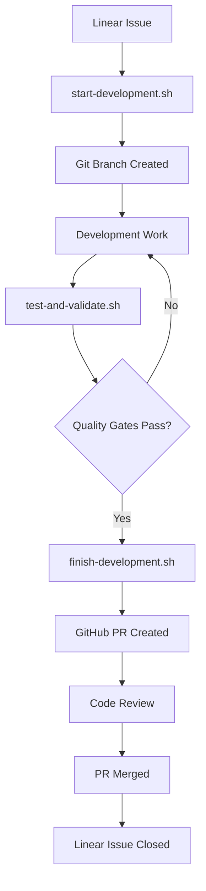

# 🎓 Training Modules

## Interactive Learning Path for Development Workflow

Welcome to the comprehensive training program for the Development Workflow system. This modular approach will take you from beginner to expert through hands-on exercises and real-world scenarios.

## 📚 Training Module Overview

| Module | Duration | Level | Prerequisites |
|--------|----------|-------|---------------|
| [Module 1: Foundations](#module-1-foundations) | 30 min | Beginner | Basic Git knowledge |
| [Module 2: Workflow Basics](#module-2-workflow-basics) | 45 min | Beginner | Module 1 completed |
| [Module 3: Testing & Quality](#module-3-testing--quality) | 60 min | Intermediate | Module 2 completed |
| [Module 4: Advanced Features](#module-4-advanced-features) | 45 min | Intermediate | Module 3 completed |
| [Module 5: Troubleshooting](#module-5-troubleshooting) | 30 min | Advanced | All previous modules |
| [Module 6: Team Collaboration](#module-6-team-collaboration) | 45 min | Advanced | Module 5 completed |

**Total Training Time: ~4.5 hours**

---

## 🏗️ Module 1: Foundations (30 minutes)

### Learning Objectives
By the end of this module, you will:
- ✅ Understand the workflow architecture
- ✅ Complete initial setup successfully
- ✅ Verify all dependencies
- ✅ Understand Linear ↔ GitHub integration

### Pre-Module Checklist
- [ ] Git installed and configured
- [ ] GitHub account with CLI access
- [ ] Linear workspace access
- [ ] Terminal/command line familiarity

### 🎯 Exercise 1.1: Environment Setup (10 minutes)

**Objective**: Set up your development environment

**Steps**:
1. Clone the repository:
   ```bash
   git clone https://github.com/franorzabal-hub/development-workflow.git
   cd development-workflow
   ```

2. Set up permissions:
   ```bash
   chmod +x scripts/*.sh
   ```

3. Configure Linear API:
   ```bash
   export LINEAR_API_KEY="lin_api_YOUR_KEY_HERE"
   # Add to your shell profile for persistence
   echo 'export LINEAR_API_KEY="lin_api_YOUR_KEY_HERE"' >> ~/.bashrc
   source ~/.bashrc
   ```

4. Authenticate with GitHub:
   ```bash
   gh auth login
   ```

**Validation**:
```bash
# Run this command - all checks should pass
./scripts/validate-dependencies.sh
```

**Expected Output**:
```
🔍 Validating Development Workflow Dependencies...

✅ Git: Available (version 2.39.0)
✅ GitHub CLI: Authenticated (user: your-username)
✅ Linear API: Connected (workspace: Your Workspace)
✅ Bash: Available (version 5.1.16)
✅ All dependencies: PASSED

🎉 Environment ready for development workflow!
```

### 🎯 Exercise 1.2: Linear State Configuration (10 minutes)

**Objective**: Configure Linear workflow states

**Steps**:
1. Run the setup script:
   ```bash
   ./scripts/setup-linear-states.sh
   ```

2. Verify configuration:
   ```bash
   cat scripts/linear-env.sh
   ```

**Expected Output**:
You should see a file with your Linear state IDs:
```bash
export LINEAR_API_KEY="lin_api_..."
export LINEAR_TODO_STATE_ID="abc123..."
export LINEAR_IN_PROGRESS_STATE_ID="def456..."
export LINEAR_IN_REVIEW_STATE_ID="ghi789..."
export LINEAR_DONE_STATE_ID="jkl012..."
```

### 🎯 Exercise 1.3: System Architecture Understanding (10 minutes)

**Objective**: Understand how the components work together

**Read and Understand**:
1. Review the [Architecture Documentation](../docs/ARCHITECTURE.md)
2. Study this workflow diagram:



**Knowledge Check**:
Answer these questions (answers at end of module):
1. What triggers the workflow to start?
2. What happens if quality gates fail?
3. How does the system update Linear issue status?

### ✅ Module 1 Completion Criteria
- [ ] All dependencies validation passes
- [ ] Linear states configured successfully
- [ ] Architecture workflow understood
- [ ] Knowledge check questions answered correctly

**Time Check**: Should complete in ~30 minutes

---

## 🚀 Module 2: Workflow Basics (45 minutes)

### Learning Objectives
By the end of this module, you will:
- ✅ Execute a complete development workflow
- ✅ Understand branch management
- ✅ Create and manage Linear issues
- ✅ Use workflow aliases effectively

### 🎯 Exercise 2.1: Create a Test Issue (10 minutes)

**Objective**: Create a Linear issue for practice

**Steps**:
1. Go to your Linear workspace
2. Create a new issue with these details:
   ```
   Title: 🧪 Test workflow implementation
   Description: Practice exercise for learning the development workflow.
   
   Acceptance Criteria:
   - [ ] Create a simple README update
   - [ ] Add a new file with basic content
   - [ ] Ensure all quality gates pass
   
   Estimate: 1 point
   Priority: Low
   ```

3. Note the issue ID (e.g., `FRA-TEST-001`)

### 🎯 Exercise 2.2: Start Development Workflow (15 minutes)

**Objective**: Start development for your test issue

**Steps**:
1. Start the workflow:
   ```bash
   ./scripts/start-development.sh FRA-TEST-001
   ```

2. Observe the output - you should see:
   - ✅ Linear issue validation
   - ✅ Branch creation
   - ✅ Status update to "In Progress"
   - ✅ Implementation plan generation

3. Check your current branch:
   ```bash
   git branch --show-current
   # Should show: username/fra-test-001-test-workflow-implementation
   ```

4. Verify Linear issue status changed to "In Progress"

### 🎯 Exercise 2.3: Make Development Changes (10 minutes)

**Objective**: Make simple changes to practice the workflow

**Steps**:
1. Update the README:
   ```bash
   echo "" >> README.md
   echo "## Training Exercise" >> README.md
   echo "This line was added during workflow training." >> README.md
   ```

2. Create a new file:
   ```bash
   echo "# Training Notes" > TRAINING_NOTES.md
   echo "Successfully practicing the development workflow!" >> TRAINING_NOTES.md
   ```

3. Commit your changes:
   ```bash
   git add README.md TRAINING_NOTES.md
   git commit -m "feat: add training exercise documentation"
   ```

### 🎯 Exercise 2.4: Install and Use Aliases (10 minutes)

**Objective**: Set up convenient command aliases

**Steps**:
1. Install aliases:
   ```bash
   ./scripts/claude-aliases.sh install
   ```

2. Reload your shell:
   ```bash
   source ~/.bashrc  # or ~/.zshrc
   ```

3. Test aliases:
   ```bash
   claude-help        # Show available commands
   claude-status      # Show current workflow status
   claude-issue FRA-TEST-001  # Show issue details
   ```

4. Practice alias usage:
   ```bash
   # These should all work now
   claude-test FRA-TEST-001
   claude-status
   ```

### ✅ Module 2 Completion Criteria
- [ ] Test issue created in Linear
- [ ] Development workflow started successfully
- [ ] Changes made and committed
- [ ] Aliases installed and tested
- [ ] Issue status updated in Linear

**Time Check**: Should complete in ~45 minutes

---

## 🧪 Module 3: Testing & Quality (60 minutes)

### Learning Objectives
By the end of this module, you will:
- ✅ Run comprehensive test suites
- ✅ Understand quality gates
- ✅ Fix code quality issues
- ✅ Interpret test results and coverage

### 🎯 Exercise 3.1: Run Initial Tests (15 minutes)

**Objective**: Run the test suite and understand the output

**Steps**:
1. Run the full validation:
   ```bash
   ./scripts/test-and-validate.sh FRA-TEST-001
   # Or with alias: claude-test FRA-TEST-001
   ```

2. Study the output sections:
   - 📋 **Code Quality Checks**: Formatting, linting, security
   - 🧪 **Test Execution**: Unit tests, integration tests
   - 📊 **Coverage Report**: Test coverage percentage
   - ✅ **Quality Gates**: Pass/fail status

3. Note any failures (expected for first run)

### 🎯 Exercise 3.2: Fix Code Quality Issues (20 minutes)

**Objective**: Address common code quality problems

**Scenario**: Let's create some code quality issues and fix them

**Steps**:
1. Create a Python file with intentional issues:
   ```bash
   cat > training_example.py << 'EOF'
   import os,sys
   import requests
   
   def fetch_data(url):
       password = "hardcoded_secret"  # Security issue
       response=requests.get(url)     # Formatting issue
       return response.json()
   
   def process_data( data ):          # Spacing issues
       if data == None:               # Style issue
           return []
       return data["items"]
   EOF
   ```

2. Add it to git and commit:
   ```bash
   git add training_example.py
   git commit -m "feat: add example with quality issues"
   ```

3. Run tests to see failures:
   ```bash
   claude-test FRA-TEST-001
   ```

4. Fix the issues one by one:
   ```bash
   # Fix formatting with Black
   black training_example.py
   
   # Fix imports with isort
   isort training_example.py
   
   # Check what Bandit security scanner found
   bandit training_example.py
   ```

5. Update the file to fix security and style issues:
   ```bash
   cat > training_example.py << 'EOF'
   import os
   import sys
   
   import requests
   
   
   def fetch_data(url):
       """Fetch data from API endpoint."""
       # Use environment variable instead of hardcoded secret
       api_key = os.getenv("API_KEY")
       response = requests.get(url, headers={"Authorization": api_key})
       response.raise_for_status()
       return response.json()
   
   
   def process_data(data):
       """Process API response data."""
       if data is None:
           return []
       return data.get("items", [])
   EOF
   ```

6. Commit the fixes:
   ```bash
   git add training_example.py
   git commit -m "fix: resolve code quality and security issues"
   ```

### 🎯 Exercise 3.3: Understanding Quality Gates (15 minutes)

**Objective**: Learn what each quality gate checks

**Steps**:
1. Run tests again and examine each section:
   ```bash
   claude-test FRA-TEST-001
   ```

2. Understanding the checks:

   **Code Formatting**:
   - `black --check` - Python code formatting
   - `isort --check` - Import sorting

   **Linting**:
   - `flake8` - Style guide enforcement
   - `mypy` - Static type checking

   **Security**:
   - `bandit` - Security vulnerability scanning

   **Testing**:
   - `pytest` - Unit test execution
   - Coverage reporting

### 🎯 Exercise 3.4: Write and Run Tests (10 minutes)

**Objective**: Add tests for your code

**Steps**:
1. Create a test file:
   ```bash
   mkdir -p tests
   cat > tests/test_training_example.py << 'EOF'
   """Tests for training example module."""
   import pytest
   from unittest.mock import Mock, patch
   
   # Import our module (adjust path as needed)
   import sys
   sys.path.append('.')
   from training_example import process_data, fetch_data
   
   
   def test_process_data_with_valid_data():
       """Test process_data with valid input."""
       data = {"items": ["item1", "item2", "item3"]}
       result = process_data(data)
       assert result == ["item1", "item2", "item3"]
   
   
   def test_process_data_with_none():
       """Test process_data with None input."""
       result = process_data(None)
       assert result == []
   
   
   def test_process_data_with_missing_items():
       """Test process_data with missing items key."""
       data = {"other_key": "value"}
       result = process_data(data)
       assert result == []
   
   
   @patch('training_example.requests.get')
   @patch.dict('os.environ', {'API_KEY': 'test_key'})
   def test_fetch_data_success(mock_get):
       """Test fetch_data with successful response."""
       mock_response = Mock()
       mock_response.json.return_value = {"items": ["test"]}
       mock_response.raise_for_status.return_value = None
       mock_get.return_value = mock_response
       
       result = fetch_data("http://test.com")
       assert result == {"items": ["test"]}
   EOF
   ```

2. Run tests to see coverage:
   ```bash
   claude-test FRA-TEST-001
   ```

3. Check if coverage meets requirements (>90%)

### ✅ Module 3 Completion Criteria
- [ ] Successfully ran full test suite
- [ ] Fixed code quality issues
- [ ] Understanding quality gates
- [ ] Added and ran unit tests
- [ ] Achieved >90% test coverage

**Time Check**: Should complete in ~60 minutes

---

## 🔧 Module 4: Advanced Features (45 minutes)

### Learning Objectives
By the end of this module, you will:
- ✅ Complete full workflow with PR creation
- ✅ Understand rollback mechanisms
- ✅ Use debug and troubleshooting features
- ✅ Handle workflow errors gracefully

### 🎯 Exercise 4.1: Complete Workflow (15 minutes)

**Objective**: Finish the development workflow

**Steps**:
1. Ensure all tests pass:
   ```bash
   claude-test FRA-TEST-001
   ```

2. Complete the workflow:
   ```bash
   ./scripts/finish-development.sh FRA-TEST-001
   # Or: claude-finish FRA-TEST-001
   ```

3. Observe the process:
   - ✅ Final validation run
   - ✅ PR creation with rich metadata
   - ✅ Linear issue status update to "In Review"
   - ✅ Branch cleanup options

4. Check the created PR:
   ```bash
   gh pr view
   ```

5. Verify Linear issue status changed to "In Review"

### 🎯 Exercise 4.2: Rollback Testing (15 minutes)

**Objective**: Practice rollback mechanisms

**Steps**:
1. Start a new test issue workflow:
   ```bash
   # Create another test issue in Linear first
   claude-start FRA-TEST-002
   ```

2. Make some changes:
   ```bash
   echo "# Rollback Test" > rollback_test.md
   git add rollback_test.md
   git commit -m "feat: add rollback test file"
   ```

3. Simulate a problem and rollback:
   ```bash
   # Test rollback functionality
   claude-rollback FRA-TEST-002
   ```

4. Verify rollback worked:
   ```bash
   git status
   git log --oneline -5
   # Check Linear issue status
   ```

### 🎯 Exercise 4.3: Debug Mode and Troubleshooting (15 minutes)

**Objective**: Learn debugging techniques

**Steps**:
1. Run workflow in debug mode:
   ```bash
   DEBUG=1 ./scripts/start-development.sh FRA-TEST-003
   ```

2. Observe the additional output:
   - Detailed API calls
   - Step-by-step execution
   - Environment variable values (masked)
   - Error context

3. Practice troubleshooting commands:
   ```bash
   # Check workflow status
   claude-status
   
   # View recent logs
   tail -20 ~/.claude-workflow.log
   
   # Test individual components
   gh auth status
   echo $LINEAR_API_KEY | head -c 20
   
   # Validate environment
   ./scripts/validate-dependencies.sh --verbose
   ```

4. Simulate and fix a common error:
   ```bash
   # Temporarily break Linear API key
   export LINEAR_API_KEY_BACKUP="$LINEAR_API_KEY"
   export LINEAR_API_KEY="invalid_key"
   
   # Try to start workflow (should fail)
   claude-start FRA-TEST-004
   
   # Fix the issue
   export LINEAR_API_KEY="$LINEAR_API_KEY_BACKUP"
   
   # Try again (should work)
   claude-start FRA-TEST-004
   ```

### ✅ Module 4 Completion Criteria
- [ ] Successfully completed full workflow with PR
- [ ] Tested rollback mechanisms
- [ ] Used debug mode effectively
- [ ] Practiced troubleshooting techniques
- [ ] Handled and fixed simulated errors

**Time Check**: Should complete in ~45 minutes

---

## 🐛 Module 5: Troubleshooting (30 minutes)

### Learning Objectives
By the end of this module, you will:
- ✅ Diagnose common workflow problems
- ✅ Use systematic debugging approaches
- ✅ Fix environment and configuration issues
- ✅ Know when and how to get help

### 🎯 Exercise 5.1: Common Error Scenarios (20 minutes)

**Objective**: Practice fixing typical problems

**Scenario 1: Permission Issues**
```bash
# Simulate permission problem
chmod -x scripts/start-development.sh

# Try to run (will fail)
./scripts/start-development.sh FRA-TEST-005

# Diagnose and fix
ls -la scripts/start-development.sh
chmod +x scripts/start-development.sh

# Verify fix
./scripts/start-development.sh --help
```

**Scenario 2: Git Configuration Issues**
```bash
# Simulate git config problem
git config --global --unset user.email

# Try workflow (may have issues)
claude-start FRA-TEST-006

# Fix git configuration
git config --global user.email "your.email@example.com"
git config --global user.name "Your Name"

# Verify fix
git config --list | grep user
```

**Scenario 3: Network/API Issues**
```bash
# Test network connectivity
curl -s https://api.github.com/user >/dev/null
echo "GitHub API: $?"

curl -s https://api.linear.app/graphql \
  -H "Authorization: $LINEAR_API_KEY" \
  -d '{"query": "{ viewer { name } }"}' >/dev/null
echo "Linear API: $?"
```

### 🎯 Exercise 5.2: Systematic Debugging (10 minutes)

**Objective**: Learn debugging methodology

**Follow this debugging checklist when issues occur:**

1. **Identify the Problem**
   ```bash
   # What exactly is failing?
   # What error message do you see?
   # When did it start failing?
   ```

2. **Check the Basics**
   ```bash
   # Validate environment
   ./scripts/validate-dependencies.sh
   
   # Check authentication
   gh auth status
   
   # Verify API key
   echo $LINEAR_API_KEY | head -c 20
   ```

3. **Enable Debug Mode**
   ```bash
   # Get detailed output
   DEBUG=1 ./scripts/problematic-command.sh
   ```

4. **Check Logs**
   ```bash
   # Review recent activity
   tail -50 ~/.claude-workflow.log
   ```

5. **Test Components Individually**
   ```bash
   # Test Git
   git status
   
   # Test GitHub CLI
   gh repo view
   
   # Test Linear API
   curl -s "https://api.linear.app/graphql" \
     -H "Authorization: $LINEAR_API_KEY" \
     -d '{"query": "{ viewer { name } }"}'
   ```

6. **Compare with Working State**
   ```bash
   # What's different from when it worked?
   # Recent changes to environment?
   # System updates?
   ```

### ✅ Module 5 Completion Criteria
- [ ] Successfully diagnosed and fixed permission issues
- [ ] Resolved git configuration problems
- [ ] Tested network connectivity
- [ ] Applied systematic debugging approach
- [ ] Know how to get help when stuck

**Time Check**: Should complete in ~30 minutes

---

## 👥 Module 6: Team Collaboration (45 minutes)

### Learning Objectives
By the end of this module, you will:
- ✅ Understand team workflow patterns
- ✅ Handle merge conflicts effectively
- ✅ Follow code review best practices
- ✅ Coordinate with team members

### 🎯 Exercise 6.1: Code Review Process (15 minutes)

**Objective**: Practice code review workflow

**Steps**:
1. Review your own PR:
   ```bash
   # View your PR
   gh pr view
   gh pr diff
   ```

2. Understand PR metadata:
   - Linear issue linking
   - Test results
   - Coverage reports
   - Quality gate status

3. Practice review commands:
   ```bash
   # Self-review for practice
   gh pr review --approve
   # or
   gh pr review --comment --body "Minor suggestion: consider adding more comments"
   ```

### 🎯 Exercise 6.2: Merge Conflict Resolution (20 minutes)

**Objective**: Handle merge conflicts gracefully

**Simulation Setup**:
1. Create a conflict scenario:
   ```bash
   # Update main branch
   git checkout main
   git pull origin main
   
   # Make conflicting change on main
   echo "# Updated Main Branch" >> README.md
   git add README.md
   git commit -m "docs: update README from main"
   git push origin main
   
   # Switch back to your feature branch
   git checkout your-feature-branch
   
   # Make conflicting change
   echo "# Updated Feature Branch" >> README.md
   git add README.md
   git commit -m "docs: update README from feature"
   ```

2. Attempt to rebase (will create conflict):
   ```bash
   git rebase origin/main
   ```

3. Resolve the conflict:
   ```bash
   # View conflict
   git status
   cat README.md
   
   # Edit file to resolve conflict
   vim README.md  # Remove conflict markers, combine changes
   
   # Continue rebase
   git add README.md
   git rebase --continue
   ```

4. Verify resolution:
   ```bash
   git log --oneline -5
   git diff origin/main
   ```

### 🎯 Exercise 6.3: Team Coordination Patterns (10 minutes)

**Objective**: Learn team collaboration best practices

**Daily Workflow Patterns**:
1. **Start of Day**:
   ```bash
   # Update main branch
   git checkout main
   git pull origin main
   
   # Check team updates
   gh pr list
   claude-status
   ```

2. **Before Starting New Work**:
   ```bash
   # Check for blocking issues
   claude-issue ISSUE-ID
   
   # Coordinate with team if needed
   # Start from latest main
   git checkout main && git pull
   ```

3. **Before Creating PR**:
   ```bash
   # Ensure you're up to date
   git rebase origin/main
   
   # Run full validation
   claude-test ISSUE-ID
   
   # Create PR with good description
   claude-finish ISSUE-ID
   ```

4. **During Code Review**:
   - Respond to feedback within 24 hours
   - Ask questions for clarity
   - Make requested changes promptly
   - Re-run tests after changes

### ✅ Module 6 Completion Criteria
- [ ] Understand code review process
- [ ] Successfully resolved merge conflicts
- [ ] Know team coordination patterns
- [ ] Ready for collaborative development

**Time Check**: Should complete in ~45 minutes

---

## 🎯 Final Assessment & Certification

### Knowledge Check Questions

Answer these questions to verify your understanding:

1. **Workflow Fundamentals**:
   - What are the three main workflow scripts and their purposes?
   - How does Linear issue status get updated automatically?

2. **Quality Gates**:
   - What are the minimum quality requirements?
   - How do you fix code formatting issues?

3. **Troubleshooting**:
   - What's the first command to run when debugging issues?
   - How do you enable debug mode?

4. **Team Collaboration**:
   - How do you resolve merge conflicts?
   - What should you do before creating a PR?

### Practical Assessment

Complete this mini-project:

1. Create a new Linear issue for adding a utility function
2. Use the workflow to implement a simple Python function
3. Add comprehensive tests achieving >90% coverage
4. Fix any quality gate issues
5. Create a PR with proper documentation
6. Simulate and resolve a merge conflict

### 🎉 Certification Completion

Once you've completed all modules and assessments:

- [ ] All 6 modules completed
- [ ] Knowledge check questions answered
- [ ] Practical assessment passed
- [ ] Can independently use the workflow
- [ ] Understand troubleshooting approaches
- [ ] Ready for team collaboration

**Congratulations! You're now certified in the Development Workflow system! 🏆**

---

## 📚 Continued Learning Resources

### Documentation References
- [Developer Workflow Guide](DEVELOPER_WORKFLOW_GUIDE.md)
- [Setup Instructions](SETUP_INSTRUCTIONS.md)
- [Best Practices](BEST_PRACTICES.md)
- [Quick Reference](QUICK_REFERENCE.md)
- [Troubleshooting Guide](../docs/TROUBLESHOOTING.md)

### Advanced Topics
- Custom workflow extensions
- Performance optimization
- Security best practices
- Monitoring and metrics
- Integration with other tools

### Support Channels
- Team Slack/Discord channels
- GitHub Issues for bugs/features
- Documentation updates
- Training feedback

---

## 🔄 Training Module Answers

### Module 1 Knowledge Check Answers:
1. **What triggers the workflow to start?** - A Linear issue ID passed to the start-development.sh script
2. **What happens if quality gates fail?** - The test script returns an error and prevents progression to PR creation
3. **How does the system update Linear issue status?** - Through Linear API calls that change issue status at each workflow phase

### Training Feedback

Please provide feedback on this training:
- What modules were most helpful?
- What could be improved?
- Additional topics to cover?
- Overall difficulty level?

*Submit feedback via GitHub issues or team channels.*

---

**🎓 Thank you for completing the Development Workflow Training! Happy developing! 🚀**